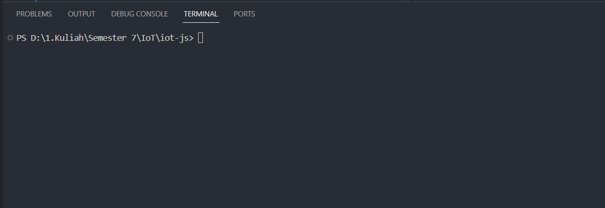
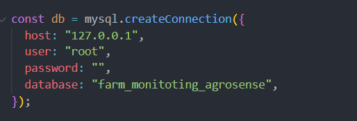
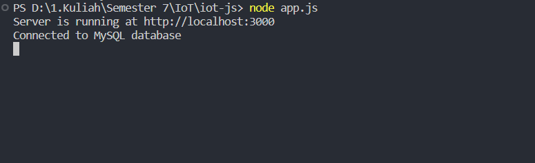
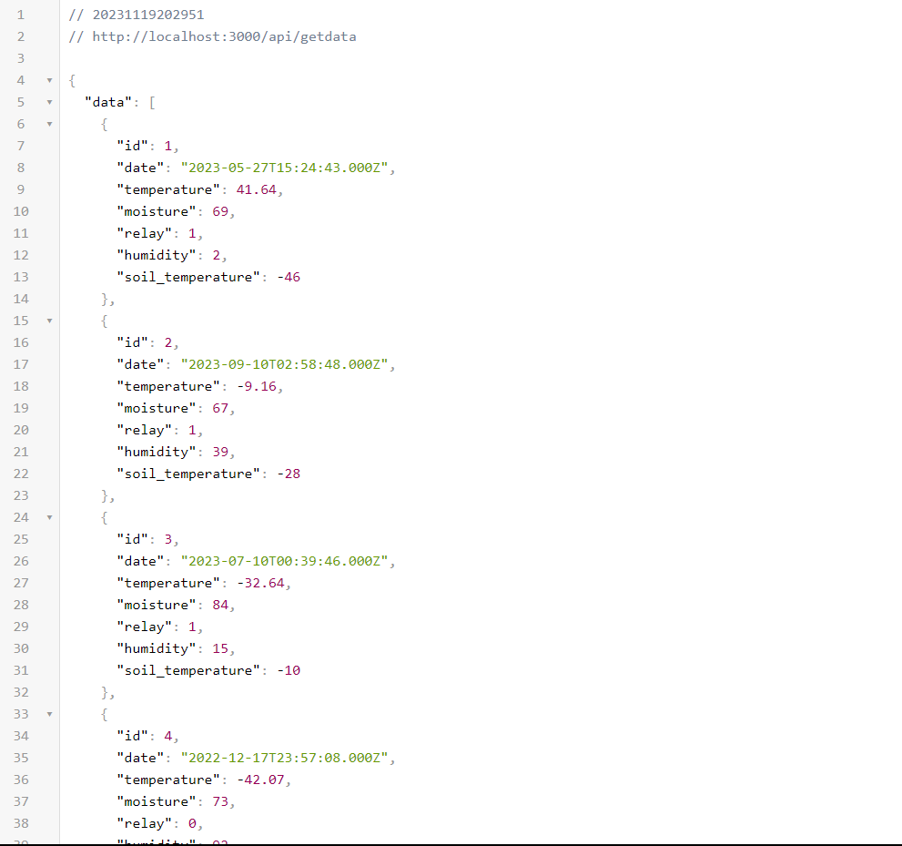
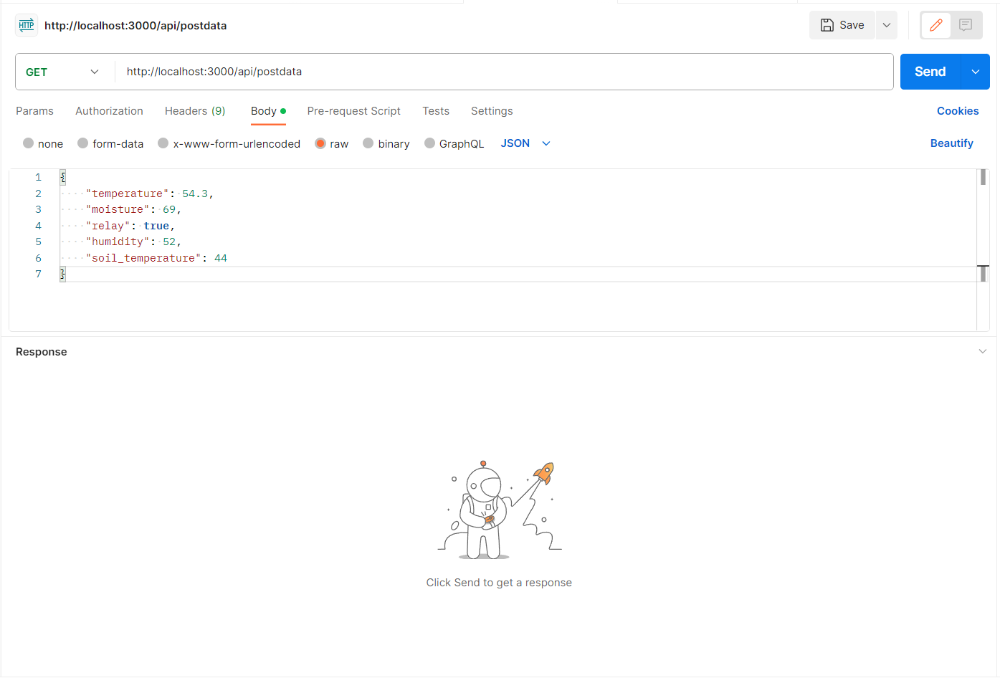

# API For IoT Project

## Teams Members :

- Aldo Jendy Parewang - 04201010
- Ahmad Usamah Ali - 11201005
- Fauzan Andyka Ramadhani - 11201031
- Ismail Saputra Sapareng - 11201042
- Jo Kevin Nataniel - 11201046
- Mochamad Sa’adila Effendi - 11201057
- Putra Cendikia Subekti - 11201074
- Sahat Matua Sinaga - 11201086

## Overview

This API use Node.JS for its runtime and Express as for framework that run on top of Node.js for create this simple API for our IoT Project

## How To Use It

1. First you can download this repository or you can use `git clone <this repos url>` for example `git clone https://github.com/EndKn1ght/IoT-API-Laravel`

2. After that, you open the command prompt or something similiar and make sure you are in the correct of the directory, like example below.
   

3. Before running the API, make sure you already config the db app.js and already start the database, if not its will not working
   

4. After that you type `node app.js` to start the localhost.
   

5. And you good to go. If you want to GET the data you can use the enpoint `http://localhost:3000/api/getData`.
   

6. If you want to POST the data you can use third party aplication or something else like Postman. For the endpoint you use `http://localhost:3000/api/postdata`.
   
   And thats it. It just a simple of kicking a ball.

## Endpoint GET Method

| Enpoint       | param1    | param2    |
| ------------- | --------- | --------- |
| /api/getdata  | none      | none      |
| /api/getweek  | year=2023 | month=9   |
| /api/getmonth | month=9   | year=2023 |

1. For `api/getdata`, you dont need input any query, it will return all the data from db.
2. For `api/getweek`, you need to put two parameter or query, the paramater need for specific time that you need. It will return mean of eachday for a month
3. For `api/getmonth`, you need to put two parameter or query, the parameter need for specific time that you need. It will return mean of each week of the mont

## Endpint POST Method

| Enpoint       | param1           | param2      | param3     | param4      | param5              |
| ------------- | ---------------- | ----------- | ---------- | ----------- | ------------------- |
| /api/postdata | temperatur=56.67 | moisture=45 | relay=true | humidity=67 | soil_temperature=55 |

1. For POST Method you can use `json` or `urlencoded`.
